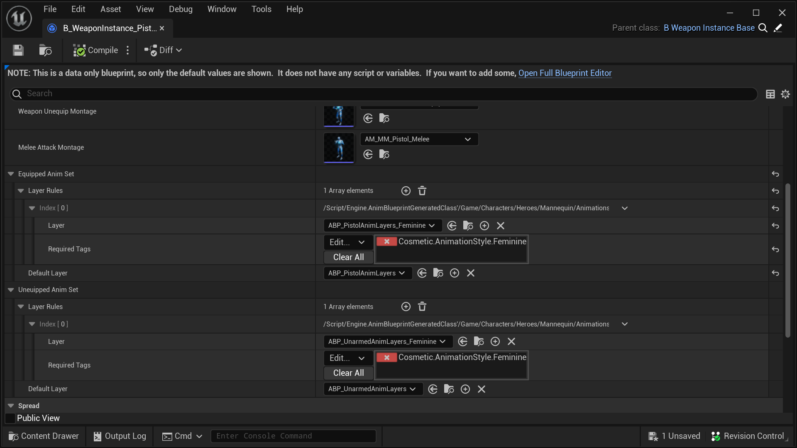

# 1 Lyra 角色部分

C++ Struct: `FLyraCharacterPart`
( Lyra 5.2
[LyraCharacterPartTypes.h](https://github.com/EpicGames/UnrealEngine/blob/5.2/Samples/Games/Lyra/Source/LyraGame/Cosmetics/LyraCharacterPartTypes.h)
)

T这是 [Lyra 角色部分](/UE5/LyraStarterGame/CharacterParts/) 系统的一部分，请参阅该页面了解概述。

## 1.1 概念概述
“角色部分”是附加到 Pawn 的 Actor，它代表角色身体的装饰部分。

实际角色身体是不可见的，装饰部分就是您看到的。

角色必须有一个或多个部分可见。在原版 Lyra 中，只定义了 2 个部分：`B_Manny` 表示男性人体模型，`B_Quinn` 表示女性人体模型。

您也可以选择使用模块化角色，即一个角色由许多不同的部分组成。

Lyra 根据所有角色部分定义的游戏标记 [驱动动画](#Animation)，例如在男性和女性动画风格之间进行选择。

### Lyra 角色部分的属性

- Actor 类类型
- 要附加到的插槽名称 *(可选)*
- 碰撞模式 *(可选)*

Actor 类可以选择实现 `IGameplayTagAssetInterface` 接口，这允许它将游戏标记传达给游戏。

Lyra 使用 `ALyraTaggedActor` C++ 类作为其装饰部件的基础

例如，设置 `男性化` 或 `女性化` 动画风格标签，以及 `中等` 身体风格。您可以根据游戏喜好从 `ALyraTaggedActor` 继承，或实现 `IGameplayTagAssetInterface`，或两者都不实现。

如果角色部件属于同一类类型并附加到同一插槽，则它们被视为等效。

出于等效性测试目的，将忽略碰撞设置中的任何差异。

## 1.2 原版（Vanilla） Lyra 角色部件

默认情况下，Lyra 仅定义两个角色部件，分别代表男性（Manny）或女性（Quinn）身体。

### Character Part: `B_Manny`

`B_Manny` 蓝图定义了 Manny 身体，即男性人体模型。

| Property      | Value                                                            |
|---------------|------------------------------------------------------------------|
| Base Class    | `ALyraTaggedActor`                                               |
| Gameplay Tags | `Cosmetic.AnimationStyle.Masculine`, `Cosmetic.BodyStyle.Medium` |
| Skeletal Mesh | `SKM_Manny`                                                      |

### Character Part: `B_Quinn`

`B_Quinn` 蓝图定义了 Quinn 身体，即女性模特。

| Property      | Value                                                           |
|---------------|-----------------------------------------------------------------|
| Base Class    | `ALyraTaggedActor`                                              |
| Gameplay Tags | `Cosmetic.AnimationStyle.Feminine`, `Cosmetic.BodyStyle.Medium` |
| Skeletal Mesh | `SKM_Quinn`                                                     |

## 1.3 通过游戏标签驱动动画
Lyra 使用 `Cosmetic.AnimationStyle.*` 游戏标签来驱动其动画，这样它就可以用“男性化”动画来为 Manny 制作动画，用“女性化”动画来为 Quinn 制作动画。

这些动画的具体工作原理超出了本文档的范围，但是一般来说，如果您对此感兴趣，这里有一些内容供您搜索。

在您的 C++ IDE 中：
- `FLyraAnimBodyStyleSelectionSet`
  - 特别是这个方法: `SelectBestLayer`
    - 当装备或未装备远程武器时，`B_WeaponInstance_Base` 蓝图会使用它来选择动画集

- `ULyraWeaponInstance`
  - 特别是这个方法：`PickBestAnimLayer`

在虚幻编辑器中：
- `B_WeaponInstance_Base`
  - 这是所有远程 [Lyra 武器](/UE5/LyraStarterGame/Weapons/) 的基类
  - 当装备或未装备武器时，它会根据所有角色部位定义的集体游戏标记相应地更改动画样式

- 搜索游戏标记资产引用：`Cosmetic.AnimationStyle.Feminine`
  - 这将向您显示引用此标记的 **所有** Lyra 蓝图，包括： `B_MannequinPawnCosmetics`、`B_Quinn`、`B_WeaponInstance_Base` 等。

### 手枪动画规则示例

例如，当 Lyra 角色装备或卸下手枪时，`B_WeaponInstance_Pistol` 蓝图定义动画规则。

上面你可以看到，如果任何角色部件定义了 `Cosmetic.AnimationStyle.Feminine`游戏标记，角色将在装备手枪时使用 `ABP_PistolAnimLayers_Feminine` 动画蓝图。

否则，将使用默认的 `ABP_PistolAnimLayers` 蓝图（男性版本）。

当未装备手枪时，如果任何角色部件定义了 `Cosmetic.AnimationStyle.Feminine`游戏标记，则将使用女性徒手动画（`ABP_UnarmedAnimLayers_Feminine`），否则将使用默认男性`ABP_UnarmedAnimLayers`。

*注意：这根本不起作用；**每种武器**都必须定义完全相同的徒手动画设置规则，但 Lyra 默认就是这样工作的。*

[Lyra 武器](/UE5/LyraStarterGame/Weapons/) 有更详细的讨论。

### 默认情况下不处理冲突的游戏标签

默认情况下，Lyra 不能很好地处理冲突的游戏标签。

如果您分配一个定义“男性化”动画的部分和另一个定义“女性化”动画的部分，Lyra 不会注意到，它只会选择其中一个。

*看起来它可能选择在“FLyraAnimBodyStyleSelectionSet”的“LayerRules”中首先定义的动画集，因此在上面的例子中，如果男性化和女性化标签由不同的角色部分定义，则始终会使用女性化动画集。*