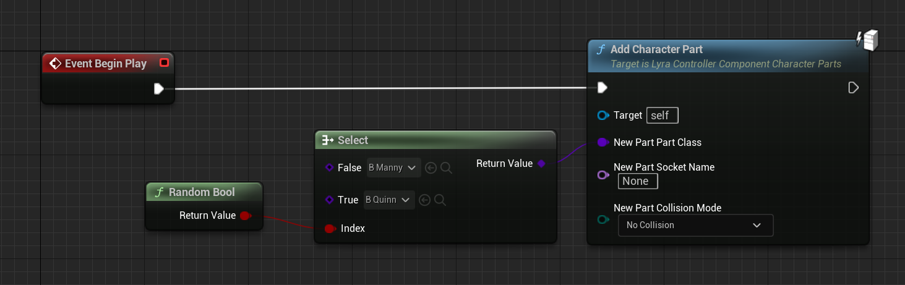
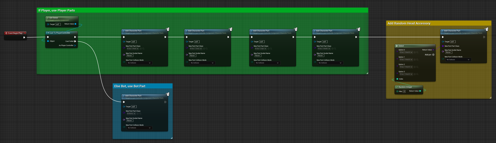

## 1.1 概念概述

角色部件控制器组件负责选择将哪些角色部件添加到任何给定的 Pawn。

当控制器组件启动时（在“BeginPlay”中），它应该初始化其将哪些角色部件放到这个 Pawn 上的想法。在 Lyra 中，这部分由蓝图处理。

然后，底层 C++ 将确保每当控制器拥有新的 Pawn 时，这些部件都会添加到新的 Pawn（通过相关的 [Pawn 组件](./PawnComponent)），并且它们会从旧 Pawn 中移除（如果有）。

### Lyra 如何设置

- `B_PickRandomCharacter` 资产是角色部件控制器组件
- 它通过体验定义注入到 **所有** `Controller` 角色中（因此它会影响玩家和机器人）
- 例如，请参阅 `B_ShooterGame_Elimination`

## 1.2 `B_PickRandomCharacter` 控制器组件

默认情况下，Lyra 5.2 中只有 2 个装饰组件：Manny 和 Quinn。

Lyra 在 Manny 或 Quinn 之间随机选择并在服务器端生成该组件；它被复制到所有客户端。

您可以在 `B_PickRandomCharacter` 蓝图中看到这一点。在 Controller 组件的 `BeginPlay` 中，它会在 Manny 或 Quinn 角色部件之间随机选择：

## 1.3 备用装饰组件

对于此示例，我创建了一个备用装饰组件，如下所示。

如果您想使用它，此蓝图类应**替换** Experience 注入中的默认 Lyra `B_PickRandomCharacter` 组件。

在此示例中，所有机器人都使用 `B_Manny` 装饰品，而所有玩家都将使用具有多个装饰部件的模块化角色，以及随机选择的头部配饰。

### 根据需要自定义

您可能希望在游戏中拥有一个非常复杂的角色化妆品系统，在这种情况下，您需要扩展它以使用所有选项来确定构成任何给定角色的化妆品。

控制器组件决定了哪些部分应该存在，所以这就是放置逻辑的地方。