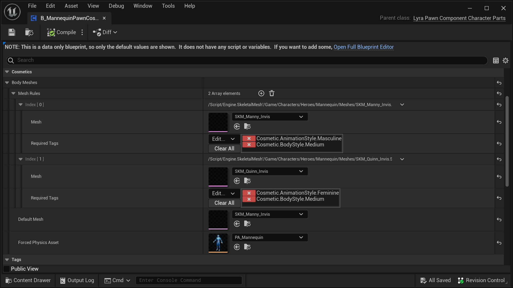
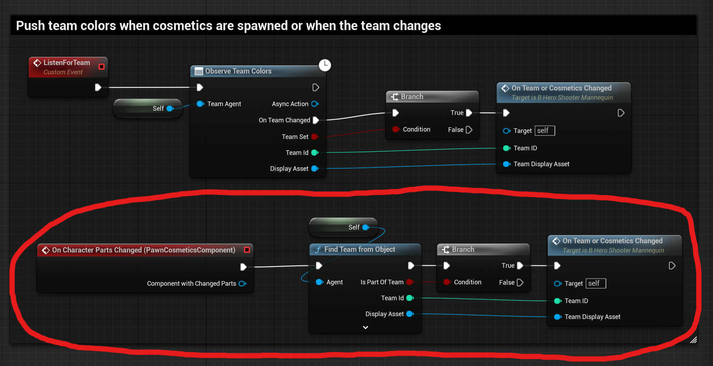

# 1 Lyra 角色部件 Pawn 组件 ("Pawn Customizer")

C++ Class: `ULyraPawnComponent_CharacterParts`
( Lyra 5.2
 [header](https://github.com/EpicGames/UnrealEngine/blob/5.2/Samples/Games/Lyra/Source/LyraGame/Cosmetics/LyraPawnComponent_CharacterParts.h)
|
 [cpp](https://github.com/EpicGames/UnrealEngine/blob/5.2/Samples/Games/Lyra/Source/LyraGame/Cosmetics/LyraPawnComponent_CharacterParts.cpp)
)

这是 [Lyra 角色部件](/UE5/LyraStarterGame/CharacterParts/) 系统的一部分，请参阅该页面了解概述。

## 1.1 概念概述

角色部件 Pawn 组件通常称为“Pawn Customizer”。

它由相关的 [Controller Component](./ControllerComponent)用于处理从服务器到远程客户端的复制。

Pawn Customizer 实现了 `On Character Parts Changed` 事件，您必须在角色中挂接该事件以查找要添加或删除的部件。例如，请参阅下面的 [Character Integration](#CharacterIntegration)
部分。

**任何给定的 Pawn 上只能有一个 Pawn Customizer 组件。**

### 角色部件 Actor 不会在专用服务器上生成

为了提高服务器效率，纯装饰 Actor（角色部件）**不会在专用服务器上生成**。

专用服务器完全没有理由生成和管理一堆没人会看到的装饰 Actor。所以它没有完成。

执行此操作的代码是 `FLyraCharacterPartList::SpawnActorForEntry`，如果你想通读它。它明确拒绝在专用服务器上生成角色部分cosmetic。

如果您尝试在调用 `GetCharacterPartActors` 后迭代cosmetic actor，这可能会造成混淆。在客户端上，这将返回一个演员数组。在服务器上，这将返回一个空数组，因为专用服务器上没有cosmetic actor。

### Lyra 如何实现这一点

- The `B_MannequinPawnCosmetics` Blueprint is based on the `ULyraPawnComponent_CharacterParts` C++ class
    - `B_Hero_ShooterMannequin` adds a `B_MannequinPawnCosmetics` component named `PawnCosmeticsComponent`

因此，每个基于“B_Hero_ShooterMannequin”的 Lyra 角色都有一个 Pawn Customizer 组件。

## 1.2 快速浏览：`B_MannequinPawnCosmetics`

Lyra 在蓝图中实现了一个 Pawn Customizer 组件：`B_MannequinPawnCosmetics`

然后他们将这个 `B_MannequinPawnCosmetics` 组件添加到 `B_Hero_ShooterMannequin` Character 类。

在这里你可以看到 `B_MannequinPawnCosmetics` 中有趣的（非默认）部分，其中定义了两个默认的 Lyra 体型：

## 1.3 您可以制作自己的组件

您可以制作自己的 Pawn Customizer 组件来定义要使用的设置。

您不一定非要使用 Lyra 默认值。

只需确保将自己的 Pawn 组件添加到您的角色中，替换 Lyra 默认的`B_MannequinPawnCosmetics`。

### 确保您与角色集成

如果您制作自己的组件，请确保将其与您的角色集成。

例如，请参阅此蓝图片段，其中默认的`B_Hero_ShooterMannequin`蓝图挂接到默认的`B_MannequinPawnCosmetics`事件`OnCharacterPartsChanged`。

如果您用自定义版本替换 Lyra 默认版本，您将需要挂接到自己的自定义组件，而不是默认的 Lyra 组件。

#### `B_Hero_ShooterMannequin` 钩子插入 `On Character Parts Changed`

## 1.4 实现细节：`FLyraCharacterPartList`

Pawn Customizer 组件中的许多工作实际上被转移到一个名为`FLyraCharacterPartList`的专用 C++ 结构。

分离出此结构的主要目的是实现网络复制。