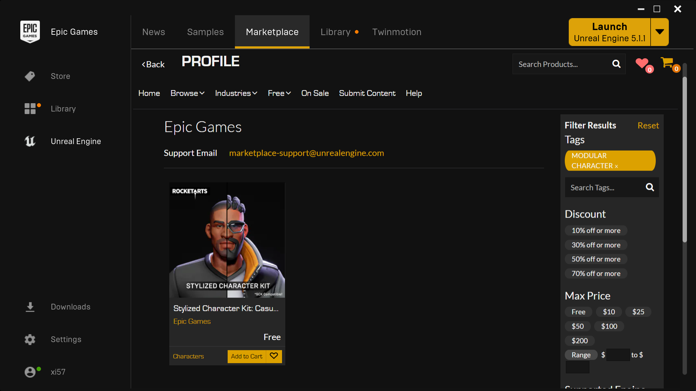

# Lyra 角色部件(Character Parts)

更新信息查看这个主题的视频 [UE5 Lyra: Character Parts Overview](https://youtu.be/PYZmQPkvY5M)

Lyra的角色部件系统受到了Fortnite的启发。角色部件(Character Parts)是纯粹的装饰性物品(purely cosmetic)，这在多人游戏中带来了一些很好的效率。例如，服务器在很大程度上可以忽略装饰性物品，而本地玩家的个人装饰性物品可以比远程玩家的装饰性物品更详细（因此更昂贵）。

在初期游戏开发中，你不一定需要实现所有这些优化，但使用Lyra角色部件系统将使你有能力在你的游戏取得巨大成功并需要这些优化时再添加这些功能。

总的来说，主要的Lyra角色网格是不可见的。你看到的可见角色是“角色部件”，纯粹是装饰性的。如果你愿意，你可以修改这一点，使一个角色由多个部分组成，以便轻松支持完全模块化的角色。

## 概念总览

角色部件
一个单一的装饰性部件
可能是整个身体的网格
也可能只是头部、躯干等
角色部件 游戏标签驱动角色动画风格

控制器组件
确定将添加到控制器的pawn上的部件
注入到所有服务器上的控制器，包括玩家和机器人
仅存在于服务器上

Pawn组件（也称为“Pawn定制器”）

处理将控制器选择的部件复制到客户端
实际上在客户端生成角色部件的角色（仅在客户端上）
存在于服务器和所有客户端上，包括远程客户端

- [角色部件Character Part](./CharacterPart)
  - 一个单一的装饰性部件
    - 可能是整个身体的网格
    - 也可能只是头部、躯干等

  - 角色部件[Gameplay Tags drive the Character Animation Style](./CharacterPart#Animation)

- [Controller 组件](./ControllerComponent)
  - 决定将哪些部件添加到控制的角色
  - 挂接到 **所有**服务器上的Controllers, 包括Player 和 Bot
  - 仅存在于**Server**

- [Pawn 组件](./PawnComponent) (AKA "Pawn Customizer")
  - 处理将控制器选择的部件复制到客户端
  - 实际在客户端生成角色部件的actor *(on clients only)*
  - 存在于服务器和所有客户端上，包括远程客户端

## Lyra角色部件系统的默认设置（Vanilla Lyra Configuration）

Lyra 5.2 默认情况下只有2个化妆部件：B_Manny 和 B_Quinn。Lyra 服务器在控制器 BeginPlay 后随机选择Manny或Quinn，并将决定复制给所有客户端。客户端自行处理生成实际部件。无论有多少装饰部件（cosmetic parts）或它们的外观如何，服务器都使用不可见的角色模型。

### Client和Server的Contexts的区别

[Controller Component](./ControllerComponent) 确定任何给定Pawn将出现哪些部件。由于注入（挂接）设置将其限制为仅在服务器上存在（对于所有玩家），它仅存在于服务器上，而不会在任何客户端上存在。

[Pawn Component](./PawnComponent)负责根据服务器复制给它的设置实际生成代表任何给定角色部件的Actor。

**It does not spawn cosmetic components on a dedicated server.**

This is worth repeating.
The server **does not** spawn cosmetic character part actors.
**ONLY clients** spawn the cosmetic character part actors.

The reason for this is that nobody is sitting on the server looking at its display.
Thus there is no reason at all to spawn and process actors that are purely cosmetic.
This is a server efficiency optimization.

If you run a server in Listen Server mode (e.g. there is a Local Player sitting at their
PC hosting a game for others to join) then the server DOES spawn cosmetic components
for the benefit of the Local Player.
However, in a Dedicated Server, where the server is handling a Remote Player client,
no cosmetic Character Part actors are spawned.

## 可用的资产

You can obviously use your own content, but here is the free stuff I used:

- Lyra 5.2+
- [Stylized Character Kit: Casual 01](https://www.unrealengine.com/marketplace/en-US/product/stylized-male-character-kit-casual) from the Epic Games Marketplace

### Free Marketplace Asset: "Stylized Character Kit: Casual 01"

This content pack is currently free on the Epic Games Marketplace (it has been free for quite a while, so I hope
it will always be free).

# References

- [Official Epic Video: Building Modular Characters in Unreal Engine (Unreal Fest 2022)](https://youtu.be/7IUpa3Pxqug)
- [Official Epic Docs: Modular Characters in UE5](https://docs.unrealengine.com/5.0/en-US/modular-characters-in-unreal-engine/)

