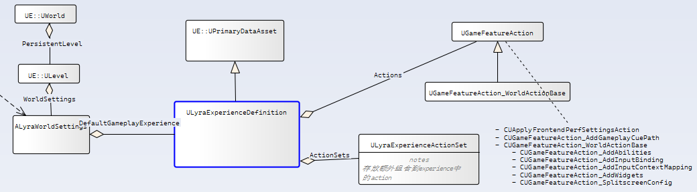
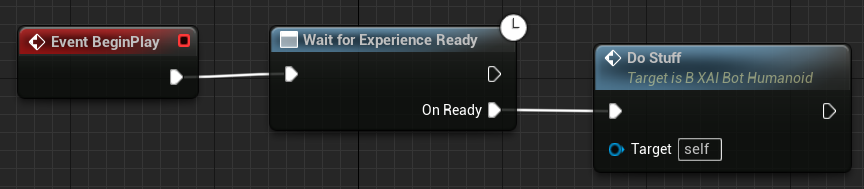

# 1 Lyra Experience

Lyra Experience 是一种定制、可配置的游戏模式/状态。在Lyra项目中，每个关卡都可以通过自定义[World Settings](#LyraWorldSettings)以指定要加载的该关卡的默认Experience。

[加载 Lyra Experience](#ExperienceLoadingProcedure)是一个异步过程。内容预期放置在游戏特性插件（GFPs）中，这些插件只有在实际需要时才会被动态加载。您的项目预期使用“On Experience Loaded”事件来启动游戏玩法，该事件在异步加载完成时触发。

Lyra Experience 的定义配置了默认的 Lyra Pawn 数据和要加载并执行的体验动作集（运行时组件注入、HUD 小部件扩展等）。

需要注意的是，在 Lyra 中，`BeginPlay` 具有不同的含义。在其他游戏中，`BeginPlay`可能字面上意味着“游戏已经开始”，但在 Lyra 中，它只表示关卡已经加载并且（可能相当缓慢的）异步加载过程已经开始。在 Lyra 中，游戏实际上不应该开始进行直到 [On Experience Loaded](#OnExperienceLoaded)事件触发，这通常发生在`BeginPlay`之后的某个时间点。您可以通过设置一些控制台变量 [console variables](#CVars)来测试延迟的体验加载，例如模拟计算机性能较差或网络延迟。这些信息可以在 LyraStarterGame 的官方文档中找到。




## 1.1 定义体验Experience的资源
`定义体验Experience的主要数据资产`
  - [Lyra Experience Definition](#LyraExperienceDefinition)
  - [Lyra Experience Action Set](#LyraExperienceActionSet)
  - [Lyra Pawn Data](#LyraPawnData)
  - [Lyra Input Config](#LyraInputConfig)
  - [Game Feature Action](#GameFeatureAction)

## 1.2  虚幻设置
  - [Lyra Game Mode](#LyraGameMode)
  - [Lyra Game State](#LyraGameState)
    - [Lyra Experience Manager Component](#LyraExperienceManagerComponent)
      - [Experience Loading Procedure](#ExperienceLoadingProcedure)
- [Lyra World Settings](#LyraWorldSettings)
- [Lyra Asset Manager](#LyraAssetManager)
- [Lyra Experience Manager](#LyraExperienceManager) Subsystem *(only relevant to PIE)*
- [Console Variables](#CVars)

## 1.3 如何初始化Experience的Gameplay
- [Event: `OnExperienceLoaded`](#OnExperienceLoaded)
  - [Usage Examples](#OnExperienceLoadedExamples)
    - [Example BP Hook Code](#ExampleHookBP)
    - [Example C++ Hook Code](#ExampleHookCPP)
- [Loading a Default Experience](#LoadingADefaultExperience)
  - Example: [Lyra Frontend State Component](#LyraFrontendStateComponent)


### 1.4 调试Tips
执行以下控制台命令来为这些模块启用详细日志记录：
- `Log LogLyraExperience Verbose`
- `Log LogGameFeatures Verbose`

在控制台中执行`ModularGameplay.DumpGameFrameworkComponentManagers`以转储调试信息，以帮助了解哪些组件被注入到哪些参与者中。请参阅[控制台变量](#CVars)，它们有助于调试。


<a id='PrimaryDataAssets'></a>
# 2 主要数据资产`Primary Data Assets`
本节介绍定义 Lyra Experience 所需的主要主要数据资产。

<a id='LyraExperienceDefinition'></a>
## 2.1 体验定义(Lyra Experience Definition)

« Primary Data Asset »
这是一个 Const 数据资产。它明确的地定义了一个Experience。
- Default [Lyra Pawn Data](#LyraPawnData)
- List of Instanced [Game Feature Actions](#GameFeatureAction)
- List of [Lyra Experience Action Sets](#LyraExperienceActionSet)
- List of Game Feature Plugin ([GFP](/UE5/GameFeatures/)) dependencies


<a id='LyraExperienceActionSet'></a>
## 2.2 体验操作集(Lyra Experience Action Set)

« Primary Data Asset »
- Array of [Game Feature Actions](#GameFeatureAction)
- Array of Game Feature Plugin ([GFP](/UE5/GameFeatures/)) dependencies used by this Action Set


<a id='LyraPawnData'></a>
## 2.3 Pawn数据(Lyra Pawn Data)

« Primary Data Asset »
- Pawn (Subclass)
- Lyra Ability Sets (Array)
- Lyra Ability Tag Relationship Mapping
- [Lyra Input Config](#LyraInputConfig)
- Lyra Camera Mode (Subclass)


<a id='LyraInputConfig'></a>
## 2.4 输入配置(Lyra Input Config)

« Const Data Asset »
- Native Lyra Input Actions (Array)
- Ability Lyra Input Actions (Array)


<a id='GameFeatureAction'></a>
## 2.5 Game Feature Action

激活`Game Feature`时采取的操作。这是实验性`GameFeatures`插件的一部分。

实例化`Game Feature`操作处理 [游戏功能](/UE5/GameFeatures/) 资源的加载和卸载。事件包括：
- 注册- Registering
- 取消注册- Registering
- 加载- Loading
- 激活- Activating
- 停用- Deactivating


**CUGameFeatureAction	继承关系**
 - CUApplyFrontendPerfSettingsAction	
 - CUGameFeatureAction_AddGameplayCuePath	
 - CUGameFeatureAction_WorldActionBase	
    - CUGameFeatureAction_AddAbilities	
    - CUGameFeatureAction_AddInputBinding	
    - CUGameFeatureAction_AddInputContextMapping
    - CUGameFeatureAction_AddWidgets
    - CUGameFeatureAction_SplitscreenConfig

<a id='EngineSetup'></a>
# 3 设置UE的Lyra Experience
本节介绍 Lyra 如何设置虚幻引擎以支持 Lyra Experience体验。

<a id='LyraGameMode'></a>
## 3.1 游戏模式（Lyra Game Mode）

Lyra 游戏模式提供 Lyra 体验支持的必需基础游戏模式。

- 使用 [Lyra 游戏状态](#LyraGameState)
- 在 `Init Game` 中：
  - 在服务器上，通过 `OnMatchAssignmentGiven` 调用 `ServerSetCurrentExperience`
- 通过模拟比赛分配添加在 PIE 启动时加载体验的支持
- 将初始玩家生成延迟到 `OnExperienceLoaded`
  - 许多其他玩家启动相关逻辑

[游戏模式的初始化](/UE5/LyraStarterGame/InitGame/)将单独讨论。


<a id='LyraGameState'></a>
## 3.2 游戏状态（Lyra Game State）
Lyra 游戏状态是 Lyra Experiences 功能的关键。Lyra 游戏状态本身相对简单，但它确实初始化并激活了两个非常重要的组件，从而实现了Experiences：
- Ability System Component
- Lyra Experience Manager Component

### 3.2.1 Ability System Component
- [Lyra Experience Manager Component](#LyraExperienceManagerComponent)


<a id='LyraExperienceManagerComponent'></a>
### 3.2.1 Lyra Experience Manager Component
`ULyraExperienceManagerComponent`负责加载和卸载、激活和停用Experiences相关的繁重工作。


<a id='ExperienceLoadingProcedure'></a>
#### 3.2.1.1 Experience加载过程（Experience Loading Procedure: `StartExperienceLoad`）在服务器和所有客户端上，必须调用 `StartExperienceLoad` (*在服务器上明确调用，并通过客户端上的复制调用*)，这将开始此过程：
- 设置状态 = `Loading`

##### 状态: Loading
- Async Load assets via [Lyra Asset Manager](#LyraAssetManager)
    - Primary Experience Asset ID
    - Experience Action Sets
    - Client/Server Game Features Subsystem
- On async load complete:
  - Set state = `LoadingGameFeatures`

##### 状态: Loading Game Features
- Async Load and Activate any/all required GFPs
- After all GFPs finish async loading:
    - Optionally delay loading for debugging purposes based on CVar settings
    - Set state = `ExecutingActions`

##### 状态: Executing Actions
- Execute all [Game Feature Actions](#GameFeatureAction) defined by the experience and its action sets
- Set state = `Loaded`

##### 状态: Loaded
- Broadcast [`OnExperienceLoaded`](#OnExperienceLoaded)


<a id='LyraWorldSettings'></a>
## 3.3 Lyra World Settings
- 为`ULevel`资产添加默认游戏体验`Default Gameplay Experience`设置
- 在 PIE 中，在 `InitGame` 期间加载默认体验
- 这可以让你指定某个Level要使用的 Lyra Experience

`Config/DefaultEngine.ini` configures the use of Lyra World Settings:

```ini
[/Script/Engine.Engine]
WorldSettingsClassName=/Script/LyraGame.LyraWorldSettings
```

<a id='LyraAssetManager'></a>
## 3.4 资产管理器(Lyra Asset Manager)

- Game-specific 实现 Asset Manager 来处理资产加载
  - 允许在配置中使用软对象指针(Soft Object Pointers)来延迟加载资产，直到真正需要它们为止
  - Allows using Soft Object Pointers in configs to delay loading of assets until they are really needed
    - Supposedly a significant performance boost as compared to *not* using Soft Object Pointers

`Config/DefaultEngine.ini` configures the use of Lyra Asset Manager:

```ini
[/Script/Engine.Engine]
AssetManagerClassName=/Script/LyraGame.LyraAssetManager
```


<a id='LyraExperienceManager'></a>
## 3.5 Lyra 体验管理器(Lyra Experience Manager)

« Engine Subsystem »

- 这是 PIE 所必需的，但除此之外对游戏没有任何作用


<a id='CVars'></a>
## 3.6 控制台变量(Console Variables)

为了测试目的，您可以为 Lyra Experience 加载过程添加延迟以模拟运行缓慢的计算机和/或网络。

- `lyra.chaos.ExperienceDelayLoad.MinSecs` (minimum delay)
- `lyra.chaos.ExperienceDelayLoad.RandomSecs` (maximum time added to `MinSecs`)


# 4 Lyra Gameplay 初始化

本节讨论了在 Lyra Experience 中启动实际游戏的预期方式。
TLDR **不要**使用 `BeginPlay` 来启动游戏，而是在 `BeginPlay` 中您需要等待`OnExperienceLoaded`。


<a id='OnExperienceLoaded'></a>
## 4.1 体验加载(On Experience Loaded)

[Lyra Experience Manager Component](#LyraExperienceManagerComponent)将在异步体验加载过程完成后广播 `OnExperienceLoaded` 事件。

您的游戏需要谨慎使用此事件来启动游戏，并且**不要**为此使用`BeginPlay`。使用`BeginPlay`启动游戏将导致间歇性错误。

Lyra 还提供了`AsyncAction_OnExperienceLoaded`，这是一个异步 BP 操作，因此您可以轻松地在 BP 中等待`OnExperienceLoaded`。例如，Lyra 在初始化其
Shooter Mannequin 角色时会执行此操作。


### 4.1.1 三个优先级

`OnExperienceLoaded` 事件以三种不同的优先级触发，以便您可以拥有一些依赖于其他更高优先级处理程序的处理程序。
- High (`OnExperienceLoaded_HighPriority`)
- Normal (`OnExperienceLoaded`)
- Low (`OnExperienceLoaded_LowPriority`)

该系统非常精简。对于复杂的相互依赖关系，您需要设计自己的解决方案，并了解回调是按随机顺序执行的。

<a id='OnExperienceLoadedExamples'></a>
### 4.1.2 C++ 和 BP 中的 `OnExperienceLoaded` 示例

有很多关于如何在 Lyra 中使用 `OnExperienceLoaded` 的示例。在 Rider 中按 `CTRL`+`SHIFT`+`F` 可查看许多有趣的 C++ 代码片段。下面讨论了一些特别有趣的示例。

#### 示例1: High Priority Examples
- Lyra Team Creation Component :: Begin Play
  - `OnExperienceLoaded` THEN Create Teams
- [Lyra Frontend State Component](#LyraFrontendStateComponent) :: Begin Play
  - `OnExperienceLoaded` THEN Start a multistep async process to show the Frontend Game Menu as soon as possible

#### 示例2: Normal Priority Examples
- Lyra Player State :: Post Initialize Components
  - `OnExperienceLoaded` THEN Set Player Pawn Data
    - 这将根据默认 Pawn 数据配置向玩家状态授予能力集
- [Lyra Game Mode](#LyraGameMode) :: Init Game State
  - `OnExperienceLoaded` THEN Restart all players who don't yet have Pawns
    - 这有效地为每个玩家/机器人分配了默认的 Pawn 数据

#### 示例3: Low Priority Examples
- Lyra Bot Creation Component :: Begin Play
  - `OnExperienceLoaded` THEN Create Bots
    - Depends on the (high priority) Lyra Team Creation Component having created the teams
    - Depends on the (normal priority) Lyra Player State having set the [Lyra Pawn Data](#LyraPawnData)


<a id='ExampleHookBP'></a>
#### BP Hook至“OnExperienceLoaded”的示例




<a id='ExampleHookCPP'></a>
#### C++ Hook至“OnExperienceLoaded”的示例

在这个 C++ 示例中，你可以按如下方式设置“BeginPlay”：

```c++
void AMyExampleActor::BeginPlay()
{
    Super::BeginPlay();

    // Boilerplate OnExperienceLoaded hook:
    // TODO consider moving this to a static helper class so you can paste 1 line instead of 5
    AGameStateBase* GameState = GetWorld()->GetGameState();
    check(GameState);
    ULyraExperienceManagerComponent* ExperienceComponent = GameState->FindComponentByClass<ULyraExperienceManagerComponent>();
    check(ExperienceComponent);
    ExperienceComponent->CallOrRegister_OnExperienceLoaded(FOnLyraExperienceLoaded::FDelegate::CreateUObject(this, &ThisClass::OnExperienceLoaded));
}
```

您还必须在`AMyExampleActor`中创建一个`OnExperienceLoaded`处理程序来接收事件：

```c++
// Called by Lyra Experience Manager
void AMyExampleActor::OnExperienceLoaded(const ULyraExperienceDefinition* Experience)
{
    DoStuff();
}
```

<a id='LoadingADefaultExperience'></a>
# 5 加默认游戏体验(Default Experience)

Lyra 通过将[Lyra Frontend State Component](#LyraFrontendStateComponent)从 [Lyra Experience Definition](#LyraExperienceDefinition)
注入到 [Lyra Game State](#LyraGameState)来将前端体验加载为默认体验。

例如，Lyra 默认用于启动游戏的地图是 `L_LyraFrontEnd`，它使用 `B_LyraFrontEnd_Experience` 作为 `默认游戏体验`。

`B_LyraFrontEnd_Experience` 中的 `AddComponents`[Game Feature Action](#GameFeatureAction)将 `B_LyraFrontendStateComponent`注入到 `LyraGameState`，这会导致 Lyra FrontEnd 体验在游戏启动时加载。


<a id='LyraFrontendStateComponent'></a>
## 5.1 前端状态组件(Lyra Frontend State Component)

`B_LyraFrontendStateComponent` 是 Lyra Frontend State Component 的简单 BP 配置，定义项目使用的菜单小部件(menu widgets)。

预计此组件将被注入到[Lyra Game State](#LyraGameState)。它注册了一个高优先级的 `OnExperienceLoaded` 回调，该回调初始化向用户显示前端菜单系统的异步过程。它与[distributed with Lyra](/UE5/LyraStarterGame/Plugins/) 的 `CommonLoadingScreen` 插件交互。这样，无论加载 Lyra Experience 需要多长时间，加载屏幕都可以显示。

一旦 Experience 加载完毕，玩家就可以查看菜单，加载屏幕将被禁用，菜单系统将显示。

- 通常，您需要制作一个 BP 版本来配置菜单小部件
- 即使您不想使用 Lyra 的 FrontEnd，也可以将其视为加载默认体验的示例组件


<br/>
<hr/>
<div class="container">
    <p> 感谢原作者 X157 &copy; 的杰出贡献！Thanks to the original author X157&copy; for his outstanding contribution!<br/>
        原始文档地址：<a href="https://x157.github.io">source</a> | <a href="https://github.com/x157/x157.github.io/issues">issues</a>
    </p>
</div>