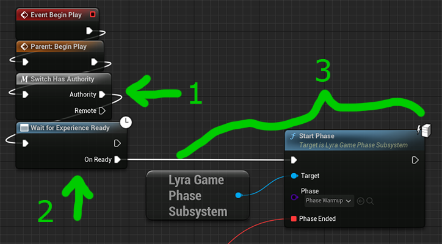
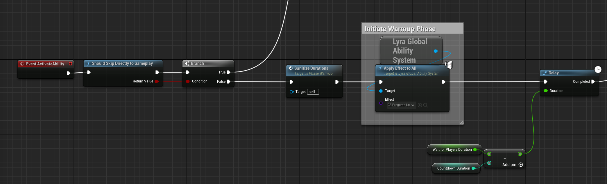

# 1 Lyra 游戏阶段(Phase)子系统 

Lyra 游戏阶段子系统使用游戏标签以嵌套方式管理 Lyra 的游戏阶段，这允许父阶段和子阶段同时处于活动状态，但兄弟阶段不能同时处于活动状态。
例如: `Game.Playing` 和 `Game.Playing.WarmUp` 可以共存,但是 `Game.Playing` 和 `Game.ShowingScore` 不能共存。

当新阶段开始时，所有非祖先phases都将结束。
例如: 当 `Game.Playing` 和 `Game.Playing.CaptureTheFlag` 处于激活， 这时候如果开始激活 `Game.Playing.PostGame` , 则 `Game.Playing` 仍将保留激活, 然而 `Game.Playing.CaptureTheFlag` 将被结束。

### 调试Tips

- Enable `LogLyraGamePhase` logging

# 2 Lyra 阶段(Phase) Ability

每个游戏阶段都由游戏能力表示。C++ 基类是 `ULyraGamePhaseAbility`。

您必须分配一个游戏阶段标签(Phase Tag)，它是代表此阶段的游戏玩法标签，例如`Game.Playing`。这个标签决定了当这个阶段开始时哪些其他能力被取消。

当该能力被激活时，它会在实际激活之前执行 `ULyraGamePhaseSubsystem`🡒`OnBeginPhase` 。这会导致旧的阶段根据新的阶段激活时的需要被结束，这取决于他们的游戏标签。

当该能力结束时，它会在结束前执行`ULyraGamePhaseSubsystem`🡒`OnEndPhase` OnEndPhase

# 3 阶段转换(Phase Transitions) 

要过渡到特定的游戏阶段，请调用`ULyraGamePhaseSubsystem`🡒`StartPhase`，并向其传递代表您希望开始的游戏阶段的游戏阶段能力。`StartPhase`会将游戏阶段能力授予GameState的GAS并激活它。

例如，在 Lyra 中`ShooterCore`，`B_ShooterGame_Elimination`体验定义将一个`B_TeamDeathMatchScoring`组件注入到游GameState中。除此之外，该GameState组件hook到BeginPlay，然后等待体验加载，最后开始`Phase_Warmup`游戏阶段。

您可以选择指定阶段结束时要执行的回调。当该`Phase_Warmup`阶段被激活时，它会执行必要的操作以开始等待其他玩家加入的时期，等等。然后它会在`Phase_Playing`需要时转换。

总体思路是，每个游戏阶段能力都会适当处理从一个阶段到下一阶段的转换。GameState本身决定游戏开始时启动哪个阶段（由 Lyra Experience 通过组件注入进行配置）。
