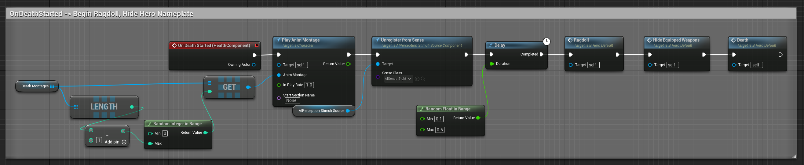
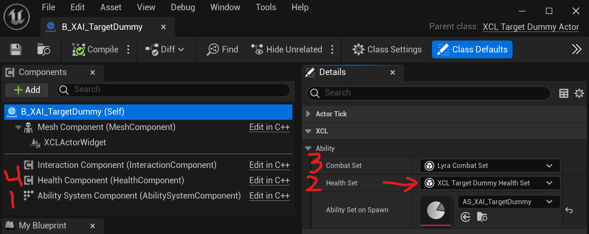

# 1 Lyra 生命值和伤害(Health and Damage)

有关此信息的overview视频 [Lyra Health and Damage System](https://youtu.be/HwQ7BrLVfJI)
, [XistGG](https://www.youtube.com/c/XistGG).

从本质上讲，Lyra 的生命值和伤害系统基于游戏能力系统 (GAS)。即使你使用Lyra，在其他工程中使用GAS给角色处理生命并、伤害或治疗，这个做法也会与Lyra中的做法非常相似。

在 Lyra 游戏中，任何想要拥有生命并可能受到伤害或治疗的角色（actor/pawn/character）都必须具有有效的、正确初始化的`AbilitySystemComponent`(ASC)，并且必须具有`LyraHealthSet`GAS 属性集。

虽然从技术上讲`LyraCombatSet`是可选的并且默认为零值，但如果参与者没有明确具有`LyraCombatSet`，Lyra 将输出警告日志。因此，除了可以消灭警告消息，实际上也需要`LyraCombatSet`。

因此，`LyraCombatSet`` 实际上是必需的，即使只是为了消除警告消息。（如果您复制/重构了 Lyra 伤害/治疗计算，您可以删除对战斗集的需要）。  
<i>{hus, a `LyraCombatSet` is practically required as well, if for no reason other than to
squelch the warning messages. (If you duplicate/refactor the Lyra Damage/Heal Calculations, you can remove the requirement for a combat set if you prefer).

Therefore by default in Lyra, to give an actor/pawn/character health, so you can damage or heal it, your actor must have:}</i> 
因此，在 Lyra 中默认情况下要给予角色(actor/pawn/character)生命值，以便你可以伤害或治疗它，你的角色必须具备：

- Lyra ASC (`ULyraAbilitySystemComponent`)  
  -允许角色使用GAS
- Lyra Health Set (`ULyraHealthSet`)
  - 定义角色的生命属性
- Lyra Combat Set (`ULyraCombatSet`)
  - 定义角色的战斗能力 (基础治疗和伤害值)

尽管不是严格要求的，但还需要添加另一个有用的组件：
- Lyra 生命组件 (`ULyraHealthComponent`)
  - 可以更轻松地读取蓝图中的health信息并处理health变化事件

## 1.1 以Lyra Character为例

默认情况下，Epic 构建了`ALyraCharacter`基类使其具有 ASC、生命值集和战斗集。因此，只要您的角色基于`ALyraCharacter` ，那么使用角色就非常容易。`ALyraCharacter`是相当复杂的，所以它并不是一个很好的例子来展示生命值和伤害在Lyra中的具体作用。

Epic 还提供了一个 C++ 类`ALyraCharacterWithAbilities`，该类未在任何官方 Lyra 代码中使用，但他们确实使用它来制作目标假人来测试 Lyra 武器。然而，最终这仍然是一个角色，并且它是基于`ALyraCharacter`的，所以同样，它并没有给出一个非常清晰的例子。

# 2 XCL Actor with Abilities

在X157©的 XCL 插件中，他制作了一个 AXCLActorWithAbilities 类。这个类的灵感来自 Lyra 的 ALyraCharacterWithAbilities。XCL Actor with Abilities 是可以参与 GAS 的角色的最简单示例。它没有任何健康信息。它不能被伤害或治疗。但它有一个 ASC，因此您可以根据需要赋予它能力或属性。

为什么要这样做？也许你想让世界中的某个角色没有任何生命信息，但它仍然拥有能力。也许这是一个游戏中的交互式电脑终端。您希望能够使用它，但不能杀死它。这就是这样一个角色的基础。

# 3 XCL Actor with Abilities and Health

下一步是采用具有能力的 XCL Actor 并向其添加生命值集、战斗集和可选但有用的“ULyraHealthComponent”。

我们从带有 Abilities 的 XCL Actor 派生，然后添加这些组件，结果是“AXCLActorWithAbilitiesAndHealth”。

现在该演员拥有生命值和战斗能力。 您可以通过应用GAS的游戏效果来治愈它或伤害它。 如果你伤害它足够多，它就会死。

## 3.1 How do I Damage it !?

要对角色造成伤害，请应用游戏效果来增加角色`HealthSet`的`Damage`属性。 当它执行时，它会将`Health`减少`Damage`数量（最小到零）。

损害角色的示例游戏效果是`GE_Damage_Basic_Instant`。

有关更多详细信息，请参阅`GE_Damage_Basic_Instant`并阅读`ULyraDamageExecution`的代码，这实际上是在 Lyra 中应用伤害效果。

## 3.2 How do I Kill it !?

在生命值为零时，生命集将触发其“OnOutOfHealth”事件。

**你有责任监听这个事件并杀死你的角色。**

因为我们向我们的 actor 添加了可选但有用的“ULyraHealthComponent”，它挂钩“OnOutOfHealth”事件并将其转换为一系列相关的，
衍生事件：

- `GameplayEvent.Death`游戏事件被发送到现在待死亡的 Actor 的 ASC
- `Lyra.Elimination.Message`消息被广播到游戏消息子系统
   - 这包括诸如哪位演员死亡以及谁杀了他们之类的信息

请注意，“ULyraHealthComponent”中有一些 TODO 注释，其中包含一些有关如何进行操作的想法，这些活动可以得到改善。 您可能有兴趣执行其中一些操作，或者添加您的而是有自己的逻辑。

在 Lyra 中，玩家和 AI 角色在生成时会被注入“GA_Hero_Death”能力。此能力会在与其所属 Actor 相关的“GameplayEvent.Death”事件上触发，并且
调用 `HealthComponent`🡒`StartDeath`，它启动杀死 actor 的过程。

监听 Health 组件的 `OnDeathStarted` 事件，并开始杀死你的 actor/pawn/character 当该事件触发时。 当“OnDeathFinished”触发时，演员应该已经死了，因为它是可能在下一个蜱虫被强行从世界上移除。

Lyra 在其“B_Hero_Default”（Lyra 角色之一）中侦听此组件的事件基本 BP）事件图。

更多信息参考 Health Component `B_Hero_Default`的 `OnDeathStarted` 事件, 以及Lyra的基础角色, 见
[Deep Dive: Lyra’s Shooter Mannequin](/UE5/LyraStarterGame/ShooterMannequin).

###### Lyra's `B_Hero_Default` Event Graph

## 3.3 如何进行治疗?

To heal the actor, apply a Gameplay Effect that increases the `Healing` attribute
of the actor's `HealthSet`.  When it executes, it will increase the `Health` by the `Healing`
amount (up to `MaxHealth`).

An example Gameplay Effect that heals an actor is `GE_Heal_Instant`.

For more details, see `GE_Heal_Instant` and read the code for `ULyraHealExecution` which
is what actually applies the healing effect in Lyra.

# 4 示例代码

该代码将无法编译，重点是举例如何做。

- [
[h](https://github.com/x157/Lyra-ActorWithAbilities/blob/main/Source/XCL/XCLActorWithAbilities.h)
|
[cpp](https://github.com/x157/Lyra-ActorWithAbilities/blob/main/Source/XCL/XCLActorWithAbilities.cpp)
]
`AXCLActorWithAbilities`
- [
[h](https://github.com/x157/Lyra-ActorWithAbilities/blob/main/Source/XCL/XCLActorWithAbilitiesAndHealth.h)
|
[cpp](https://github.com/x157/Lyra-ActorWithAbilities/blob/main/Source/XCL/XCLActorWithAbilitiesAndHealth.cpp)
]
`AXCLActorWithAbilitiesAndHealth`
- [
[h](https://github.com/x157/Lyra-ActorWithAbilities/blob/main/Source/XCL/XCLTargetDummyHealthSet.h)
|
[cpp](https://github.com/x157/Lyra-ActorWithAbilities/blob/main/Source/XCL/XCLTargetDummyHealthSet.cpp)
]
`UXCLTargetDummyHealthSet`
- [
[h](https://github.com/x157/Lyra-ActorWithAbilities/blob/main/Source/XCL/XCLTargetDummyActor.h)
|
[cpp](https://github.com/x157/Lyra-ActorWithAbilities/blob/main/Source/XCL/XCLTargetDummyActor.cpp)
]

`AXCLTargetDummyActor`

As described here, `AXCLActorWithAbilities` and `AXCLActorWithAbilitiesAndHealth` should pose no surprises at all.

`UXCLTargetDummyHealthSet` is a simple derivation of `ULyraHealthSet` with the only difference being that I never allow the `Health` attribute to drop below `1`.  In this way, the Target Dummy will never die, and I can hit it as many times as I want.

`AXCLTargetDummyActor` is a derivation of `AXCLActorWithAbilitiesAndHealth`.  It adds a skeletal mesh and it defines the override of `UXCLTargetDummyHealthSet` in the `ObjectInitializer` that it passes to its `Super` (`AXCLActorWithAbilitiesAndHealth`).

Thus, the Target Dummy has health and can be damaged and healed, but it can never die, because of the special overridden Health Set it uses which does not allow Health to drop to zero.

# 5 What this looks like in Editor

Red numbers highlight the vital components:

1. Ability System Component
2. Health Set 
3. Combat Set
4. Health Component

The Health Set has a red arrow showing that the default value is the `XCL Target Dummy Health Set`,
which is as we expect given the code.

There are a few things you see here that aren't in the example.
These do not affect damage or healing:

- The `XCLActorWidget` is the health bar widget in the video example.
- The `Interaction Component` is an XCL Interaction Component which allows the player of my game to interact with this actor.

The `AS_XAI_TargetDummy` asset shown there is a Lyra Ability Set.  The only thing defined there
is a Gameplay Effect that is a periodic +20 Health/second heal.  That way when I send my Target Dummy
down to `1` HP, it fully regenerates in 5 seconds.

# 6 概括

您对如何完成这些计算以及结果有很大的控制权值是。 要行使这种控制权，您必须学习 GAS，特别是：游戏属性定义了角色的生命状况（或护盾、法力或其他），以及游戏效果是您在游戏过程中修改这些值的方式。

- [Attributes and Attribute Sets](https://docs.unrealengine.com/5.0/en-US/gameplay-attributes-and-attribute-sets-for-the-gameplay-ability-system-in-unreal-engine/) (Epic Documentation)
- [Attributes and Gameplay Effects](https://docs.unrealengine.com/5.0/en-US/gameplay-attributes-and-gameplay-effects-for-the-gameplay-ability-system-in-unreal-engine/) (Epic Documentation)

Attributes can contain **way more info** than just the health.

让某些东西是“活的”只是一个开始。`:-)`

 

    
 感谢原作者 X157 &copy; 的杰出贡献！Thanks to the original author X157&copy; for his outstanding contribution!

        原始文档地址：<a href="https://x157.github.io">source</a> | <a href="https://github.com/x157/x157.github.io/issues">issues</a>
    

