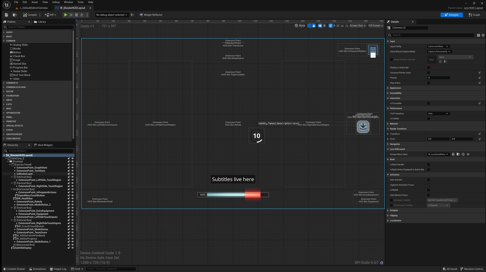
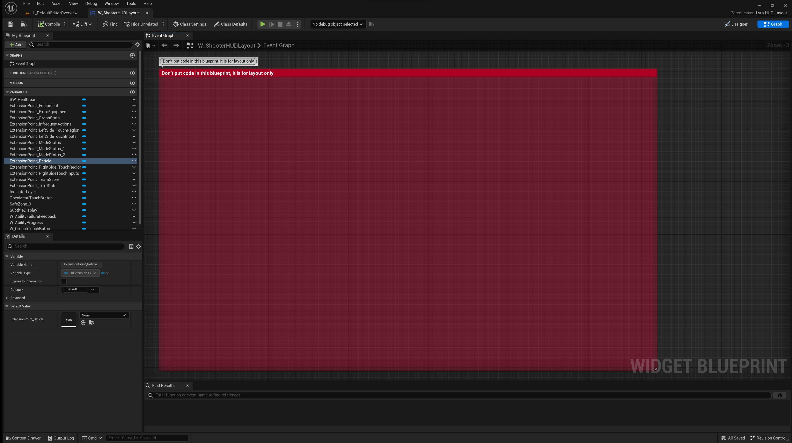

# 1 Lyra HUD 布局

Lyra HUD 布局小部件旨在实现由[Lyra UI 策略](./UIPolicy) 定义的[可激活小部件](/UE5/CommonUI/ActivatableWidget) 容器层的根小部件（root widget）。

- 此小部件**纯粹用于布局**目的
- 允许 HUD 元素的大图放置和协调
  - 定义 [UI 扩展](/UE5/UIExtension/) 点以及它们在视觉和层次上如何相互关联
  - **不应包含蓝图逻辑**、事件、函数或变量。**仅限布局**。

- 是 Lyra [可激活小部件](/UE5/CommonUI/ActivatableWidget)
  - 返回 Lyra 特定的“获取所需输入配置”设置
    - 您可能希望为自己的项目重写此方法以支持您自己的输入样式

- 处理“Esc”键按下以打开游戏菜单
- 输入模式似乎必须处于“游戏+UI”或“菜单”中才能正常工作

# 2 Lyra HUD 布局示例
“ShooterCore” GFP 中的“W_ShooterHUDLayout”：

如您所见，**仅布局**，无代码！

