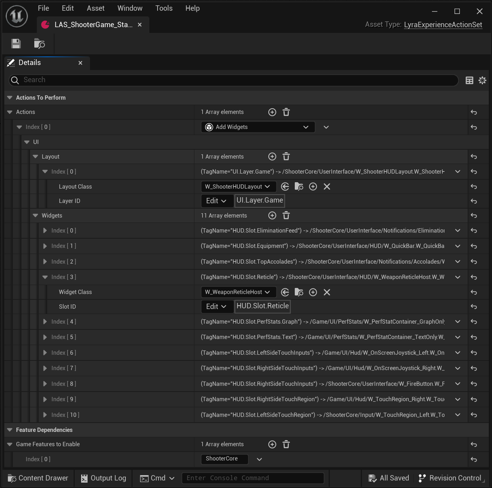

# `LAS_ShooterGame_StandardHUD`

这是 `ShooterCore` GFP 中 [Lyra HUD 布局](./HUDLayout)的游戏功能操作示例实例。

加载 `ShooterCore` 体验时，它们将此 Lyra 体验操作集列为要执行的游戏功能操作之一。

当“添加小部件”游戏功能操作执行时，它会：
- 将新的“W_ShooterHUDLayout”小部件（[Lyra HUD 布局](./HUDLayout)）推送到“UI.Layer.Game”UI 层上
- 为每个不同的“HUD.Slot.*”UI 扩展点创建适当的小部件，包括：
  - 为“HUD.Slot.Reticle”插槽创建“W_WeaponReticleHost”

### Lyra 5.2 屏幕截图

