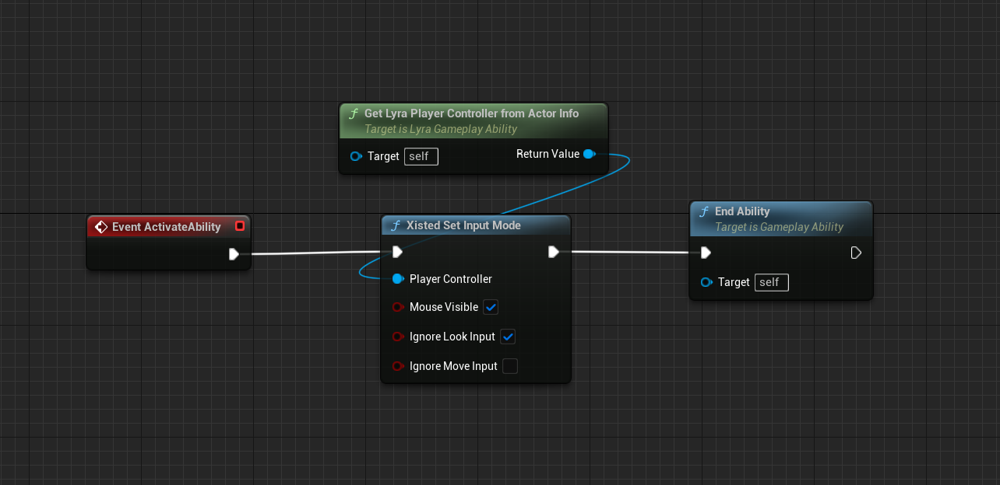

# 如何在 Lyra 中控制鼠标

[Lyra](/UE5/LyraStarterGame/)使用 [CommonUI](/UE5/CommonUI/)管理基于 Lyra 的游戏中菜单系统和小部件。有关如何将它们全部连接在一起的概览，
请参阅我的 [Lyra 输入概述](/UE5/LyraStarterGame/Input/)。

[此 YouTube 视频教程](https://youtu.be/A9dp3cmCFtQ)涵盖了此开发日志中概述的材料。阅读此日志并一起观看视频可能有助于使材料更清晰。

本教程将向您展示如何在基于 Lyra 的游戏中完全控制鼠标和输入模式。

如果您想要：
- 允许用户在玩游戏时使用鼠标（例如，不仅仅是用于菜单导航）
- 在玩游戏期间更改输入模式

## 概念概述

您必须使用 CommonUI 来更改输入模式。请勿使用旧的 UE4 方法，它们在 Lyra 中不起作用。

1. 创建您自己的“更改输入模式”方法
  - 必须调用 CommonUI 的 Action Router `SetActiveUIInputConfig` 方法来提交输入模式更改
  - 示例：[Xisted 设置输入模式](#XistedSetInputMode)

2. *(可选)* 覆盖基本 [CommonUI Action Router](/UE5/CommonUI/ActionRouter)
  - 完全覆盖其 `ApplyUIInputConfig` 方法
  - 示例：[Xisted UI Action Router](#XistedUIActionRouter)

<a id='XistedSetInputMode'></a>
## 示例：Xisted 设置输入模式
| File Type | URL                                                                                                                                             |
|-----------|-------------------------------------------------------------------------------------------------------------------------------------------------|
| Header    | [XistedInputModeStatics.h](https://github.com/XistGG/LyraMouseTutorial/blob/main/Source/LyraMouseTutorial/Public/XistedInputModeStatics.h)      |
| CPP       | [XistedInputModeStatics.cpp](https://github.com/XistGG/LyraMouseTutorial/blob/main/Source/LyraMouseTutorial/Private/XistedInputModeStatics.cpp) |


这是一个蓝图函数库的示例，它提供了一个静态 C++方法，可供 C++ 或蓝图代码使用。

在此示例中，有 3 个可能的开关：
- 设置鼠标可见？（布尔值）
- 忽略查看输入？（布尔值）
- 忽略移动输入？（布尔值）

您必须传入要更改其输入模式的玩家控制器，然后根据这 3 个开关的设置，它将计算适当的CommonUI `FUIInputConfig`，设置鼠标可见性，然后调用CommonUI 动作路由器的 `SetActiveUIInputConfig` 方法。


### C++ 使用示例

```c++
APlayerController* PC = /*YOU_MUST_SET_THIS*/;

bool bVisibleMouse = true;
bool bIgnoreLook = true;
bool bIgnoreMove = false;

UXistedInputModeStatics::XistedSetInputMode(PC, bVisibleMouse, bIgnoreLook, bIgnoreMove);
```


### Blueprint 使用示例

在此示例游戏能力蓝图中，我们调用静态蓝图函数库方法“XistedSetInputMode”来更改当前拥有该能力的玩家控制器的输入模式。

[](./screenshots/ChangeInputMode.png)

## 让它按你想要的方式工作

你可能想要一个不同的实现。很好。让它按你想要的方式工作。

此代码将帮助你入门，你可以根据需要进行自定义。

### 注意事项

在此示例代码中，我将其设置为在鼠标不可见时使用`CapturePermanently_IncludeInitialMouseDown`鼠标捕获模式。

这是 FPS 游戏的典型设置，其中鼠标用于查看/瞄准并且通常你不希望它可见。

在我们确实希望鼠标可见的时候，我改用`CaptureDuringMouseDown`，除非鼠标按下，否则不会捕获鼠标。

这意味着每次单击（当鼠标位于游戏视口上方时）都将发送到游戏并可在游戏中使用。

如果你改用类似`NoCapture`的东西，那么第一次点击将“丢失”并且只有其他每次点击才会进入游戏。

这些设置以及其他设置都是高度特定于游戏的，因此请尝试使用它们，直到找到适合您的游戏的设置。


<a id='XistedUIActionRouter'></a>
## 示例：Xisted UI 操作路由器

| File Type | URL                                                                                                                                         |
|-----------|---------------------------------------------------------------------------------------------------------------------------------------------|
| Header    | [XistedUIActionRouter.h](https://github.com/XistGG/LyraMouseTutorial/blob/main/Source/LyraMouseTutorial/Public/XistedUIActionRouter.h)      |
| CPP       | [XistedUIActionRouter.cpp](https://github.com/XistGG/LyraMouseTutorial/blob/main/Source/LyraMouseTutorial/Private/XistedUIActionRouter.cpp) |

在此示例覆盖 `UCommonUIActionRouterBase` 中，我实现了对 `ApplyUIInputConfig` 方法的完整覆盖。有关更多详细信息，请参阅头文件中的注释。

请注意，您**不需要**保留我在此处使用的相同实现。您可能希望您的游戏输入模式以不同的方式运行。根据需要修改实现。

还请注意，您*可能*实际上不需要更改默认的 Common UIAction Router。要了解是否需要，请参阅视频教程部分：
“[如何知道是否必须覆盖应用 UI 输入配置](https://youtu.be/A9dp3cmCFtQ?t=784s)”

